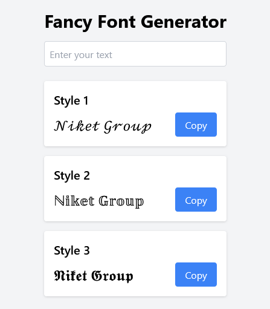
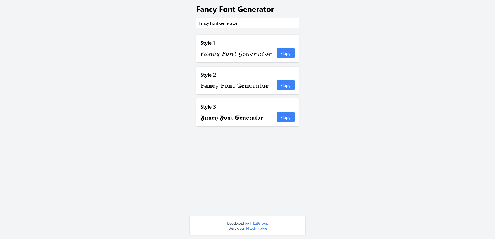

# Fancy Font Generator

Fancy Font Generator is a React-based web application that allows users to generate stylish and fancy text fonts for use on social networks, websites, and more. The tool provides multiple font styles with the ability to copy the generated text to the clipboard.

## Features

- **Multiple Font Styles:** Generate text in various fancy font styles.
- **Copy to Clipboard:** Easily copy the generated text for use anywhere.
- **Responsive Design:** Works seamlessly on desktop and mobile devices.
- **Default Text:** Shows "Niket Group" as the default text when the input is empty.
- **Developed with React and Tailwind CSS:** Fast, modern UI with clean code.

## Demo

You can see the app in action [here](https://your-demo-url.com) (Replace with your live demo URL).

## Installation

To run this project locally, follow these steps:

1. **Clone the repository:**

   ```bash
   git clone https://github.com/niteshpawar97/Fancy-Font-Generator.git
   cd Fancy-Font-Generator
   ```

2. **Install dependencies:**

   ```bash
   npm install
   ```

3. **Start the development server:**

   ```bash
   npm run dev
   ```

4. **Build for production:**

   To create a production build, run:

   ```bash
   npm run build
   ```

## Usage

1. Enter your desired text in the input field.
2. Browse through the various font styles displayed.
3. Click the "Copy" button next to your preferred style to copy the text to your clipboard.
4. Use the copied text wherever you like!

## Technologies Used

- **React:** JavaScript library for building user interfaces.
- **Tailwind CSS:** Utility-first CSS framework for styling.
- **Vite:** Fast development build tool.

## Contributing

Contributions are welcome! If you'd like to improve the project, please fork the repository and create a pull request with your changes.

## License

This project is licensed under the MIT License. See the [LICENSE](LICENSE) file for details.

## Developed By

- **NiketGroup** - [Website](https://niketgroup.in)
- **Developer: Nitesh Kadve** - [LinkedIn](https://in.linkedin.com/in/niteshkadve)


## Screenshots

You can add screenshots to showcase your app. Screenshots help users quickly understand what the app looks like and how it works.


## Screenshots

### Home Page



### Fancy Font Styles




## Deployment

If you’re deploying your Fancy Font Generator to a platform like Vercel, Netlify, or GitHub Pages, you can add deployment instructions:


## Deployment

### Vercel

To deploy the project on Vercel:

1. **Install Vercel CLI:**

   ```bash
   npm install -g vercel
   ```

2. **Deploy:**

   ```bash
   vercel
   ```

### Netlify

To deploy the project on Netlify:

1. **Create a New Site:** Sign up and create a new site on [Netlify](https://www.netlify.com/).
2. **Connect to Your Repository:** Choose your Git repository to connect.
3. **Deploy:** Netlify will automatically detect the build settings and deploy your site.

### GitHub Pages

To deploy the project on GitHub Pages:

1. **Build the Project:**

   ```bash
   npm run build
   ```

2. **Install GitHub Pages CLI:**

   ```bash
   npm install gh-pages --save-dev
   ```

3. **Deploy:**

   Add the following to your `package.json`:

   ```json
   "homepage": "https://github.com/niteshpawar97/Fancy-Font-Generator",
   "scripts": {
     "predeploy": "npm run build",
     "deploy": "gh-pages -d build"
   }
   ```

   Then run:

   ```bash
   npm run deploy
   ```

## Troubleshooting

Provide common issues users might encounter and how to resolve them:


## Troubleshooting

### Common Issues

- **Page Not Loading:** Ensure that all dependencies are installed correctly with `npm install`.
- **Styles Not Displaying Correctly:** Double-check that Tailwind CSS is set up properly in your project.

### Getting Help

If you encounter any issues, feel free to open an issue on the [GitHub repository](https://github.com/niteshpawar97/Fancy-Font-Generator/issues).


## Future Features

Mention any features you plan to add in the future:


## Future Features

- **More Font Styles:** Adding additional unique font styles.
- **User Customization:** Allowing users to create their own styles.
- **Export Options:** Enabling users to download the text as an image or PDF.


## Acknowledgments

If you’d like to acknowledge any resources or inspiration for your project:


## Acknowledgments

- [Tailwind CSS](https://tailwindcss.com) for providing an excellent utility-first CSS framework.
- [React](https://reactjs.org/) for making it easy to build interactive user interfaces.
- Special thanks to all contributors and the open-source community.

